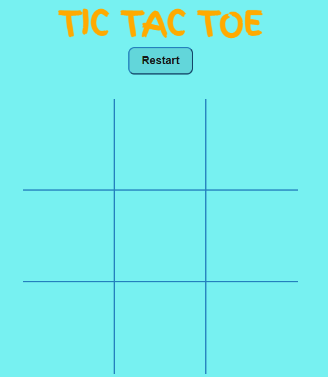
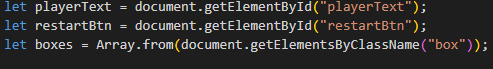
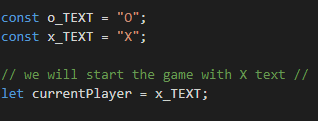
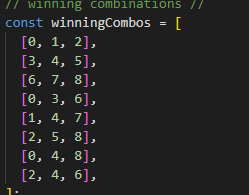
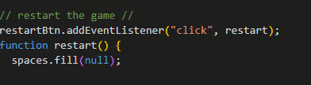
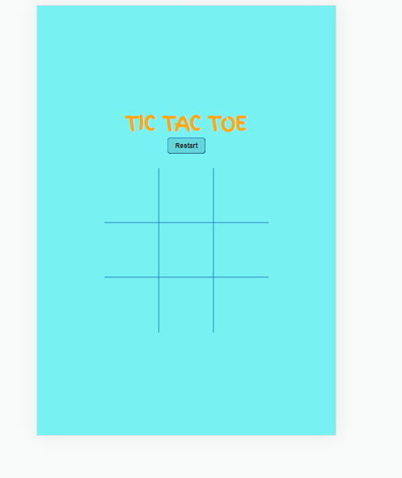
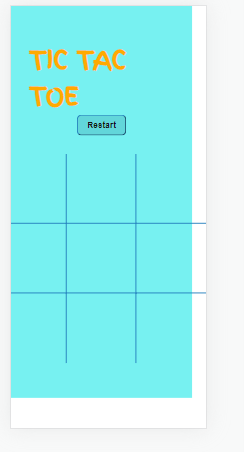
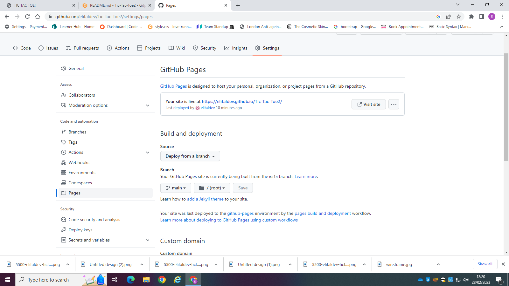

# TIC TAC TOE

[View live project here on GitHub](https://elitaldev.github.io/Tic-Tac-Toe2)

TIC TAC TOE.

   
  

## CONTENTS

- [UXD (User Experience Design)](#user-experience-ux)
  - [User Stories](#user-stories)
- [Creation process (Strategy -> Surface)](#creation-process)
  - [Wireframes](#wireframes)
- [Design](#design)
  - [Colour Scheme](#color-scheme)
  - [Typography](#typography)
  - [Imagery](#imagery)
- [Page Features](#page-features)
  - [Navbar](#navbar)
  - [Hero-Image](#hero-image)
  - [Tagline & Call to Action](#tagline--call-to-action)
  - [Menu Page](#menu-page)
  - [Contact Page](#contact-page)
  - [Footer](#footer)
- [Functions](#functions)
- [Desktop](#desktop-tablet--mobile-differences)
- [Mobile View](#mobile-view-iphone-5iphone-seiphone-xriphone-12-pro)
- [Future Features](#future-features)
- [Technologies Used](#technologies-used)
  - [Languages Used](#languages-used)
  - [Frameworks, Libraries, Technologies & Programs Used](#frameworks-libraries-technologies--programs-used)
- [Deployment](#deployment)
  - [How to deploy](#how-to-deploy)
- [Testing](#testing)
  - [HTML Validation using W3C Validation](#html-validation-using-w3c-validation)
  - [CSS Validation using W3C Validation](#css-validation-using-w3c-validation)
  - [Lighthouse scores via Chrome Developer Tools](#lighthouse-scores-via-chrome-developer-tools)
  - [Bugs & Fixes](#bugs--fixes)
  - [Unsolved Bugs](#unsolved-bugs)
- [Credits](#credits)

---
### **Primary Goal**

To make a move, the player will use the mouse single click to mark a space. In this version, there is no provision to undo the move. As soon as the move is done, the game proceeds to the next player’s chance.

### **First Time Visitor**

- the game has only one page to navigate.
- A user can access the game using mouse and has to pass the mouse to the next player.
- A user can restart the game using the restart button on the top of the screen.

## Creation Process

we have three files which is html , css and js files.
i created 9 blocks in html file and styled it in css file and make the game work using javascript.

### **1. Strategy**

- First i created an array then i created some functionality for the game.
- The game will start with the X text.
- When a player clicks the button, it will be saved and that button cannot be used again. so O text does not override X text.
- I have added eventlistener to each of my dom elements.
- I have given a each block for one player, that means if current playe, play X the next player can only play O.
- We have a restart button which will restart the game and clear out spaces array.
- i have created winning combination.

### \*\*2. game

\*\*

This is a game for kids under 10 years old.
it has been created simple and easy to play.

### **3. Structural**

the game has got a simple structure with 9 blocks and a restart button and when aplayer has won, the game is over.

### **4. Skeleton**

the game was developed to be simple, clear and easy to play..

### Wireframes

Wireframe - Homepage Desktop

## Design

### **Color Scheme**

this game used 4 pallet color scheme.
[color scheme](./assets/image/pallet.color.png)

### **Typography**

[Google Fonts](https://fonts.googleapis.com) was used to import the fonts 'finger paint', cursive'.

 

### **buttons**

restart button in light blue has been set.
player can hover over the button and a little animation will be applied.

 

## Functions

-The above variables is to set the buttuns and blocks of the game.

- The above content shows creat functiomality of the game and the game will start with the "x" text.

-The above content shows that certain combinations that player nedds to hit in order to win the game. when you have "x" in a row and "o2 in a row,also vertically and horizontally.
this shows how i have created the combinathons.

-The above content shows how the restart button can be clicked and start a new game.

## Tablet & Mobile View

### **Desktop, Tablet & Mobile Differences**

desktop view is available but not supported on all platforms.
when it goes smaller than 450px it doesn't work.
it works in desktop and tablet views.

### **Tablet View (iPad Mini/iPad Pro/Surface Pro)**

### **Mobile View (iPhone 5/iPhone SE/iPhone XR/iPhone 12 Pro)**

## Future Features

- for future features i would like to use more colores and aharder game using javascript to make a game for adults.

### **Languages Used**

- HTML5
- CSS3
- JavaScript

### **Frameworks, Libraries, Technologies & Programs Used**

- GitHub - used to save and store all files for this website
- Git - used for version control
- Google Fonts - fonts were imported from here
- Google Dev Tools - to debug and for testing responsiveness
- Google Lighthouse - for auditing the website
- W3C Validator - for validating the HTML and CSS code

---

## Deployment

### **How to deploy**

GitHub was used to deploy the website. These were the steps taken to acheive this:

1. Login to GitHub account
2. Navigate to the project repository, toc tac toe2
3. Click the Settings button near the top of the page
4. In the left-hand menu, find and click on the Pages button
5. In the Source section, choose 'main' from the drop-down, select branch menu
6. Select 'root' from the drop-down folder menu
7. Click 'Save' and after a few moments the project will have been made live and a link is visible at the top of the page

---

## Testing

### **Initial testing plan**

I had planned for this game to be accessible and legible on all screen sizes. I deployed my site halfway through to test on real-world devices. These devices included:

- Acer Aspire 3 Laptop (1920 X 1080)

- iPad Pro 2021
- iPhone SE(2016)
- when it goes smaller than 450px, it won't be responsive.

### **Testing**

Testing took place throughout the entire build using Dev Tools on Chrome and on the above real-world devices. The browsers used were:

- Chrome
- Firefox
- Edge
- Safari

The results of feature testing are as follows:

| Page    | Test                                                                     | Pass/Fail |
| :------ | :----------------------------------------------------------------------- | :-------: |
| All     |                                                                          |   Pass    |
| All     | Underline appears under navigation items when the mouse hovers           |   Pass    |
| All     | Underline stays under active navigation item                             |   Pass    |
| All     | Navigation links bring the user to relevant page                         |   Pass    |
| All     | Footer social media icons bring the user to relevant sites via a new tab |   Pass    |
| All     | 'book now button take the user to contact page                           |   Pass    |
| All     | Images and sections are responsive in different media sizes              |   Pass    |
| Index   |
| Index   | view button take user to price list page                                 |   Pass    |
| Menu    |
| Menu    | Menu items are clear and legible                                         |   Pass    |
| Contact | Contact form required elements are responsive                            |   Pass    |
| Contact | Form submit button brings you to a validation page                       |   Pass    |
| Contact | Google Map is interactive and opens in a new tab for a larger map        |   Pass    |

Further device testing took place in Dev Tools on:

- iPhone 4/5/6/7/8
- iPhone XR/ iPhone 12 Pro
- Pixel 5
- Samsung Galaxy s20

### **HTML Validation using W3C Validation**

Index/landing page HTML validation

  
  
 

### **CSS Validation using W3C Validation**

tic tac toe CSS validation

 

### **Lighthouse scores via Chrome Developer Tools**

 
      
  
  
### **Bugs & Fixes**  
  
| Bug | Section | Fix |
| :----| :----| :--------:|
| I had a problem with the functionality of the game- it was supposed to display "x"'s and "o"'s but it only displayed x's | All pages | After reading through my code I discovered that I was using capital "x"'s and capital "o"'s. This meant that the program would only display "x"'s. Once I had changed the letters to lowercase, the game worked and displayed both "x"'s and "o"'s.   |
| I had problem with winning combination const, I didn't undrestand the whole concept  | Index/Home page | After searching and after my teacher explained to me it became understandable for me.|
| I also had issue with hovering on the restart button | Index/Home page | After searching on w3 school website and going through CSS I was able to fix the problem. |

### **Unsolved Bugs**

- I have a unsolved bug in winnerIndicator, what i was aiming was to have the winner's block to be highlighted when the player win.
but unfortunately i couldn't find a way to fix this.but I will try to find a solution for my future project.

---

## Credits

### **Content References**

- All content written for the website is by myself, is purely fictional, and for educational purposes only.
- [Code Institute](https://codeinstitute.net/ie/) for their HTML/CSS learning material and 'content zoom' module in all the projects.
- [W3Schools](https://www.w3schools.com/) for additional learning material.
- [youtube](https://www.youtube.com/) to get more Idea and learn more about making a game.
- [fontawesem](https://fontawesome.com/) for the icons.
- [Browserstack](https://www.browserstack.com/guide/)

### **Acknowledgements**

- I would like to acknowledge my Code Institute mentor, Richey Malhotra, for his guidance and encouragement on this project.
- My family for testing my work and offering positive thoughts and hot cups of tea throughout the project.
