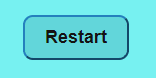

# TIC TAC TOE

[View live project here on GitHub](https://elitaldev.github.io/lunaria/)

TIC TAC TOE is a simple game with HTML, JAVASCRIPT and CSS.

   
  

---

## CONTENTS

- [UXD (User Experience Design)](#user-experience-ux)
  - [User Stories](#user-stories)
- [Creation process (Strategy -> Surface)](#creation-process)
  - [Wireframes](#wireframes)
- [Design](#design)
  - [Colour Scheme](#color-scheme)
  - [Typography](#typography)
  - [Imagery](#imagery)
- [Page Features](#page-features)
  - [Navbar](#navbar)
  - [Hero-Image](#hero-image)
  - [Tagline & Call to Action](#tagline--call-to-action)
  - [Menu Page](#menu-page)
  - [Contact Page](#contact-page)
  - [Footer](#footer)
- [Desktop](#desktop-tablet--mobile-differences)
- [Mobile View](#mobile-view-iphone-5iphone-seiphone-xriphone-12-pro)
- [Future Features](#future-features)
- [Technologies Used](#technologies-used)
  - [Languages Used](#languages-used)
  - [Frameworks, Libraries, Technologies & Programs Used](#frameworks-libraries-technologies--programs-used)
- [Deployment](#deployment)
  - [How to deploy](#how-to-deploy)
- [Testing](#testing)
  - [HTML Validation using W3C Validation](#html-validation-using-w3c-validation)
  - [CSS Validation using W3C Validation](#css-validation-using-w3c-validation)
  - [Lighthouse scores via Chrome Developer Tools](#lighthouse-scores-via-chrome-developer-tools)
  - [Bugs & Fixes](#bugs--fixes)
  - [Unsolved Bugs](#unsolved-bugs)
- [Credits](#credits)

---

### **Primary Goal**

To make a move, the player will use the mouse single click to mark a space. In this version, there is no provision to undo the move. As soon as the move is done, the game proceeds to the next player’s chance.

### **First Time Visitor**

- the game has only one page to navigate.
- A user can access the game using mouse and has to pass the mouse to the next player.
- A user can restart the game using the restart button on the top of the screen.

## Creation Process
we have three files which is html , css and js files.
i created 9 blocks in html file and styled it in css file and make the game work using javascript.

### **1. Strategy**
- First i created an array then i created some functionality for the game.
- The game will start with the X text.
- When a player clicks the button, it will be saved and that button cannot be used again. so O text does not override X text.
- I have added eventlistener to each of my dom elements.
- I have given a each block for one player, that means if current playe, play X the next player can only play O.
- We have a restart button which will restart the game and clear out spaces array.
- i have created winning combination.

### **2. game
**

This is a game for kids under 10 years old.
it has been created simple and easy to play.

### **3. Structural**

the game has got a simple structure with 9 blocks and a restart button and when aplayer has won, the game is over.

### **4. Skeleton**
the game was developed to be simple, clear and easy to play..

### Wireframes

Wireframe - Homepage Desktop

## Design

### **Color Scheme**
this game used fresh light blue color scheme to 

### **Typography**

[Google Fonts](https://fonts.googleapis.com) was used to import the fonts 'finger paint', cursive'.

.
  
 

### **buttons**

restart button in light blue has been set.
player can hover over the button and a little animation will be applied.

 

 

## Tablet & Mobile View

### **Desktop, Tablet & Mobile Differences**

To ensure responsivity I used sm and md from bootstrap. and contact sections were displayed in a row format for desktops but this switched to a column for smaller screen sizes. The header and footer remained the same, whilst images were resized to fit the display.

### **Tablet View (iPad Mini/iPad Pro/Surface Pro)**

### **Mobile View (iPhone 5/iPhone SE/iPhone XR/iPhone 12 Pro)**

## Future Features
- for future features i would like to use more colores and  aharder game using javascript to make a game for adults.

### **Languages Used**

- HTML5
- CSS3
- JavaScript

### **Frameworks, Libraries, Technologies & Programs Used**

- GitHub - used to save and store all files for this website
- Git - used for version control
- Google Fonts - fonts were imported from here
- Google Dev Tools - to debug and for testing responsiveness
- Google Lighthouse - for auditing the website
- W3C Validator - for validating the HTML and CSS code

---

## Deployment

### **How to deploy**

GitHub was used to deploy the website. These were the steps taken to acheive this:

1. Login to GitHub account
2. Navigate to the project repository, toc tac toe2
3. Click the Settings button near the top of the page
4. In the left-hand menu, find and click on the Pages button
5. In the Source section, choose 'main' from the drop-down, select branch menu
6. Select 'root' from the drop-down folder menu
7. Click 'Save' and after a few moments the project will have been made live and a link is visible at the top of the page

---

## Testing

### **Initial testing plan**

I had planned for this game to be accessible and legible on all screen sizes. I deployed my site halfway through to test on real-world devices. These devices included:

- Acer Aspire 3 Laptop (1920 X 1080)

- iPad Pro 2021
- iPhone SE(2016)
- when it goes smaller than 450px, it won't be responsive.

### **Testing**

Testing took place throughout the entire build using Dev Tools on Chrome and on the above real-world devices. The browsers used were:

- Chrome
- Firefox
- Edge
- Safari

The results of feature testing are as follows:

| Page    | Test                                                                     | Pass/Fail |
| :------ | :----------------------------------------------------------------------- | :-------: |
| All     |                                     |   Pass    |
| All     | Underline appears under navigation items when the mouse hovers           |   Pass    |
| All     | Underline stays under active navigation item                             |   Pass    |
| All     | Navigation links bring the user to relevant page                         |   Pass    |
| All     | Footer social media icons bring the user to relevant sites via a new tab |   Pass    |
| All     | 'book now button take the user to contact page                         |   Pass    |
| All     | Images and sections are responsive in different media sizes              |   Pass    |
| Index   |                                    
| Index   |view button take user to price list page                                 |   Pass    |
| Menu    | 
| Menu    | Menu items are clear and legible                                         |   Pass    |
| Contact | Contact form required elements are responsive                            |   Pass    |
| Contact | Form submit button brings you to a validation page                       |   Pass    |
| Contact | Google Map is interactive and opens in a new tab for a larger map        |   Pass    |

Further device testing took place in Dev Tools on:

- iPhone 4/5/6/7/8
- iPhone XR/ iPhone 12 Pro
- Pixel 5
- Samsung Galaxy s20

### **HTML Validation using W3C Validation**

Index/landing page HTML validation

  
  
 

### **CSS Validation using W3C Validation**

tic tac toe CSS validation

 

### **Lighthouse scores via Chrome Developer Tools**

 
      
  
  
### **Bugs & Fixes**  
  
| Bug | Section | Fix |
| :----| :----| :--------:|
| Whitespace added to right-hand side of webpages | All pages | Using Dev Tools, I added a thin red border to every element in my website. From this, I discovered that I had mistyped a value in my footer padding section and made it too large. This was pushing the footer element outside of the webpage width. I adjusted the padding to the correct value and the issue was resolved. |
| Nesting button element & anchor element | Index/Home page | When running an early W3C validation test, I discovered that I had made an error by placing a button element inside an anchor element within my tagline section. Semantically, this was incorrect. I considered using a span element instead and upon consulting Stackoverflow and this [post](https://stackoverflow.com/questions/6393827/can-i-nest-a-button-element-inside-an-a-using-html5) I confirmed my understanding. I re-checked my HTML code with W3C Validator and my live site to find the issue resolved. |
| Flexbox issues with positioning business ethos section - elements bunched together | Index/Home page | As I was learning flexbox whilst completing the project, I had not yet fully understood the div parent/child relationship. I consulted the Mozilla Developer Docs for Flexbox and discovered that I was not using enough divs for the elements to display correctly. I placed each of my headings, paragraphs, and images within divs and applied flexbox properties to their parent divs and themselves. Assigning flex-direction: row and justify-content: space-around/space-between solved my issue, with each of the elements positioning themselves with appropriate spacing between. I then applied this structure to the remaining two ethos items. |
| br element in li element  | Menu Page |  Semantically I made an error by using the br element to make space between my menu items. On performing the W3C validation test, I became aware of this error. I considered using margin-top to fix the issue. I Googled the issue to understand my error further and came across a Stackoverflow [post](https://stackoverflow.com/questions/66564503/wrong-validation-on-element-br-in-ul-li-elements), with a comment from Quentin detailing how to use margin-top avoiding the first child element of the parent div. I used this piece of code in my CSS file to control the spacing between the menu items after understanding the code fully. |
| Viewport meta tag  | Head section/All pages | On first deploying my website to real devices, the mobile pages were appearing zoomed in upon loading. They appeared normally on Dev Tools mobile testing sizes. I checked my CSS code and my viewport meta tag for any obvious errors. Upon finding none I consulted Stackoverflow to find this [post](https://stackoverflow.com/questions/14272420/webpage-starts-zoomed-in-on-mobile-devices). I removed the initial-scale=1.0 from the viewport meta tag, leaving only width=device-width, I ran the code through the W3C Validator to find no errors. This fixed the issue on all real-world mobile and tablet devices |
| Index page styling disappeared | Index/Home page | Due to commenting out the wrong section of CSS code, I had caused styling on my home page to disappear. Checking the code, I spotted the error and rectified it. |
| Textarea misalignment | Contact page | Due to a developer mistype, I had altered my CSS code for my contact form textarea. I re-added display:block and margin:auto to center the element again. |

### **Unsolved Bugs**

- On viewing my deployed site on Safari browser, I found the Josefin Sans font to be displayed differently in the header elements. The website is still displayed adequately despite this issue. I will continue my learning to understand how to combat small, browser display differences to discover if I can overcome this.

- On occasion, when viewing my website in Dev Tools, a small amount of whitespace appears to the right of the Home page. When I refresh the page or clear the cache, this issue resolves itself. I have not figured out yet why this happens on rare occasion.

- Even though my site is responsive on Dev Tools and on real world devices, it does not work on multiple-media, screenshot generating websites like 'ui.dev/amiresponsive'. It appears zoomed in, similar to the viewport meta tag issue as documented above. I have yet to figure out why this is the case.

---

## Credits

### **Content References**

- All content written for the website is by myself, is purely fictional, and for educational purposes only.
- [Code Institute](https://codeinstitute.net/ie/) for their HTML/CSS learning material and 'content zoom' module in the Love Running project.
- [W3Schools](https://www.w3schools.com/) for additional learning material.
- [MDN Web Docs](https://developer.mozilla.org/en-US/docs/Learn/CSS/CSS_layout/Flexbox) for flexbox tutorials and guidance.
- [dev.to](https://dev.to/snkds/how-to-create-striped-backgrounds-with-css-5dfn) for the CSS diagonal stripes tutorial.
- Alan from Code Institute Tutor Support for helping me with an element width issue in my media queries.
- [StackOverflow](https://stackoverflow.com/questions/66564503/wrong-validation-on-element-br-in-ul-li-elements) guidance on removing br element from menu li items to improve semantic HTML
- [Browserstack](https://www.browserstack.com/guide/what-are-css-and-media-query-breakpoints#:~:text=Essentially%2C%20media%20query%20breakpoints%20are,offers%20an%20optimal%20user%20experience.) for media queries and breakpoints guidance.
- [Elaine Broche](https://github.com/elainebroche-dev/ms1-thrive) Design inspired by Elaine's striking juice website.
- [Kera Cudmore - Creating your First README](https://github.com/kera-cudmore/readme-examples) for README structure and Markdown guidance.

### **Media References**

- [Unsplash](https://unsplash.com/), [Pexels](https://www.pexels.com/), and [Pixabay](https://pixabay.com/) for all images used on this site. Credit to photographers Jonathan Cooper, Lukas, Katie Rainbow, Kyle Hinkson, and Dulce Silvagni.
- [Font Awesome](https://fontawesome.com/) for the icons used in the footer of this site.
- [Favicon](https://favicon.io/) for the favicon used for this site.
- [Google Maps](https://www.google.com/maps) for the map used in this site.

### **Acknowledgements**

- I would like to acknowledge my Code Institute mentor, Richey Malhotra, for his guidance and encouragement on this project.
- My family for testing my work and offering positive thoughts and hot cups of tea throughout the project.
